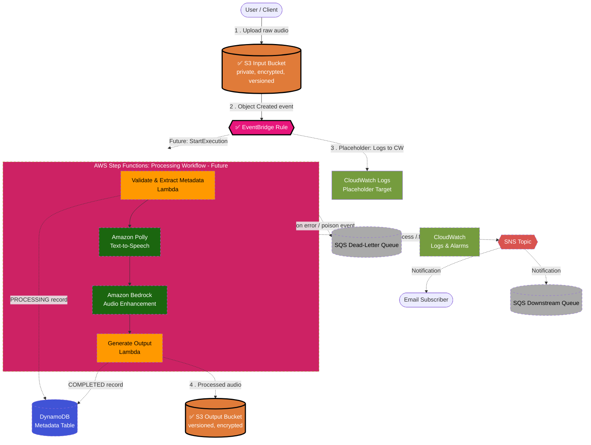

# Architecture: Event-Driven Sleep Audio Pipeline (Target Design)

> **Status:** This document describes the **intended target architecture** and is the
> **single source of truth** for every future issue and pull request. It is a living design
> spec, not a reflection of what is currently deployed. See the
> [Implementation Status](#implementation-status) section for the current state of the CDK
> stack. No CDK stack code is written for this design issue — implementation begins in
> subsequent TDD issues, starting with *"[3] TDD: Core S3 Buckets + EventBridge Rule"*.

---

## 1. High-Level Overview

The **Sleep Audio Pipeline** is a fully serverless, event-driven system on AWS, built with
TypeScript AWS CDK following strict Test-Driven Development. Users upload raw audio (voice
recordings, ambient sounds) to an input **S3 bucket**. Each upload emits an event that is
routed by **EventBridge** to an **AWS Step Functions** state machine, which orchestrates the
processing workflow: validation and metadata extraction, optional **Amazon Polly**
text-to-speech (soothing narration) and optional **Amazon Bedrock** AI audio enhancement /
generation. Processed artifacts land in a versioned output **S3 bucket**, processing metadata
is persisted to **DynamoDB**, and completion or error notifications are fanned out via **SNS**.

Design goals:

- **Decoupled & asynchronous** — producers (uploads) never block on processing.
- **Orchestrated** — Step Functions makes the multi-step workflow explicit, retryable, and
  observable, rather than chaining Lambdas implicitly.
- **Secure by default** — least-privilege IAM, encryption at rest and in transit, private
  buckets with public access blocked.
- **Observable** — structured CloudWatch Logs, metrics, and alarms on failures.
- **Multi-environment** — `dev` / `stage` / `prod` driven by CDK context, with no hard-coded
  account IDs or secrets.

---

## 2. Implementation Status

| Component | Status | CDK construct / file |
|---|---|---|
| Architecture & design docs | ✅ Done | `ARCHITECTURE.md` |
| CDK app skeleton | ✅ Done | `bin/cdk-base.ts`, `lib/cdk-base-stack.ts` |
| Jest + assertions setup | ✅ Done | `test/cdk-base.test.ts` |
| CI workflow | ✅ Done | `.github/workflows/ci.yml` |
| Multi-environment context (dev/stage/prod) | ⬜ Not started | — |
| S3 Input Bucket | ✅ Done | `lib/cdk-base-stack.ts` (SleepAudioInputBucket) |
| EventBridge Rule (S3 → Step Functions) | ✅ Done | `lib/cdk-base-stack.ts` (S3ObjectCreatedRule) |
| Step Functions Orchestrator | ⬜ Not started | — |
| Lambda – Validation / Metadata Extraction | ⬜ Not started | — |
| Amazon Polly Integration (TTS) | ⬜ Not started | — |
| Amazon Bedrock Integration (enhancement) | ⬜ Not started | — |
| Lambda – Output Generation | ⬜ Not started | — |
| DynamoDB Metadata Table | ⬜ Not started | — |
| S3 Output Bucket (versioned) | ✅ Done | `lib/cdk-base-stack.ts` (SleepAudioOutputBucket) |
| SNS Notification Topic | ⬜ Not started | — |
| SQS Dead-Letter Queue | ⬜ Not started | — |
| CloudWatch Alarms | ⬜ Not started | — |

> This table **must** be updated in the same commit as every infrastructure change.

---

## 3. Data Flow

1. **Upload** — A user (or client app) uploads a raw audio file to the **S3 input bucket**
   under a per-user key prefix (e.g. `uploads/<user_id>/<filename>.wav`).
2. **Event detection** — S3 emits an `Object Created` event. With S3 EventBridge
   notifications enabled, the event is delivered to the default **EventBridge** event bus.
3. **Routing** — An **EventBridge rule** matches `Object Created` events for the input bucket
   (filtered by prefix/suffix) and starts an execution of the **Step Functions** state
   machine, passing the bucket name and object key as input.
4. **Orchestrated processing** — The Step Functions workflow runs the steps below, with
   built-in retries and a `Catch` path that records failures and notifies via SNS:
   - **Validate & extract metadata** — A Lambda task verifies the file type/size, extracts
     duration and basic audio metadata, and writes an initial `PROCESSING` record to DynamoDB.
   - **Generate soothing voice (Amazon Polly)** — Optionally synthesise narration / guided
     sleep audio from supplied text using Polly, writing the synthesised speech to the output
     bucket.
   - **Enhance / generate audio (Amazon Bedrock)** — Optionally call a Bedrock model to
     enhance the audio or generate AI sleep soundscapes.
   - **Persist output** — A Lambda task writes the processed artifact to the **versioned S3
     output bucket** under a deterministic key and updates the DynamoDB record to `COMPLETED`.
5. **Notify** — On success or failure the workflow publishes a message to the **SNS topic**;
   subscribers (email, SQS, downstream Lambdas) react accordingly.
6. **Error handling** — Failed asynchronous invocations and unmatched/poison events are
   captured in an **SQS dead-letter queue** for inspection and replay.

---

## 4. Implemented Core Components (Issue #3)

The following foundational components are now implemented and tested:

### S3 Input Bucket (SleepAudioInputBucket)
- **Encryption**: S3-managed encryption (SSE-S3) at rest
- **Versioning**: Enabled to track all changes and prevent data loss
- **Public Access**: Completely blocked (all four public access settings enabled)
- **EventBridge Integration**: Enabled to emit Object Created events to the default event bus
- **SSL Enforcement**: Bucket policy denies all non-HTTPS requests
- **Retention**: RETAIN policy protects against accidental deletion

### S3 Output Bucket (SleepAudioOutputBucket)
- **Encryption**: S3-managed encryption (SSE-S3) at rest
- **Versioning**: Enabled to protect processed outputs and enable rollback
- **Public Access**: Completely blocked
- **SSL Enforcement**: Bucket policy denies all non-HTTPS requests
- **Retention**: RETAIN policy protects against accidental deletion

### EventBridge Rule (S3ObjectCreatedRule)
- **Event Pattern**: Matches `Object Created` events from the input bucket
- **State**: Enabled and ready to route events
- **Target**: Currently routes to a placeholder CloudWatch Logs group
  - *Note*: The target will be replaced with a Step Functions state machine in Issue #4
- **Description**: Documents the rule's purpose for future maintainers

All components follow AWS best practices:
- Least-privilege IAM (custom resources have minimal required permissions)
- Encryption at rest and in transit
- Private by default (no public access)
- Infrastructure as code with comprehensive test coverage (15 passing tests)

---

## 5. Key AWS Services & Rationale

| Concern | Service | Why it was chosen |
|---|---|---|
| Ingestion / storage | **Amazon S3** | Durable (11 nines), cheap object storage; native EventBridge integration; output bucket uses **versioning** to protect against overwrites and enable rollback. |
| Event routing | **Amazon EventBridge** | Native S3 event source, content-based filtering, zero polling, easy fan-out and decoupling of producers from consumers. |
| Orchestration | **AWS Step Functions** | Makes the multi-step workflow explicit and auditable; built-in retries, error catching, timeouts, and visual execution history; preferred over implicit Lambda chaining. |
| Compute | **AWS Lambda** | Serverless, pay-per-use, auto-scaling task workers invoked by Step Functions for validation, metadata, and output generation. |
| Text-to-speech | **Amazon Polly** | Managed neural TTS for generating soothing narration / guided-sleep voice without managing models. |
| AI audio | **Amazon Bedrock** | Managed foundation-model access for optional audio enhancement or AI-generated sleep soundscapes, no model hosting required. |
| Metadata persistence | **Amazon DynamoDB** | Serverless, single-digit-ms latency, flexible schema; partition by `user_id`, sort by upload timestamp / object key; GSI for querying by processing status. |
| Notifications | **Amazon SNS** | Decoupled multi-subscriber pub/sub for completion and error notifications. |
| Reliability | **Amazon SQS (DLQ)** | Durable capture of failed/poison events for inspection and replay. |
| Observability | **Amazon CloudWatch** | Logs, metrics, and alarms across Lambda, Step Functions, and DynamoDB. |
| IaC | **AWS CDK (L2/L3, TypeScript)** | Type-safe, composable, high-level constructs; testable with `aws-cdk-lib/assertions`. |

---

## 6. Mermaid Diagram

> **Note**: Components marked with ✅ are **implemented and tested**. Components without ✅ are planned for future issues.

**Legend:**
- ✅ = Implemented and tested (Issue #3)
- Solid boxes with thick border = Implemented components
- Dashed boxes/arrows = Planned for future implementation
- Placeholder target will be replaced with Step Functions in Issue #4

---

## 7. Security

- **Private buckets** — Both S3 buckets block all public access; access only via IAM roles.
- **Encryption at rest** — S3 (SSE-KMS or SSE-S3), DynamoDB, SNS, and SQS all encrypted.
- **Encryption in transit** — TLS enforced; bucket policies deny non-HTTPS (`aws:SecureTransport`) requests.
- **Least-privilege IAM** — Each Lambda / Step Functions task gets a scoped role granting only
  the specific actions and ARNs it needs (e.g. `s3:GetObject` on the input bucket,
  `s3:PutObject` on the output bucket, `dynamodb:PutItem`/`UpdateItem` on the table, scoped
  `polly:SynthesizeSpeech` and `bedrock:InvokeModel`). No wildcard `*` resources or actions.
- **No hard-coded secrets** — Configuration via CDK context / SSM Parameter Store; no account
  IDs or credentials committed to source.
- **Output versioning** — Versioning on the output bucket guards against accidental
  overwrite/deletion and supports recovery.

---

## 8. Observability

- **Structured logging** — Lambda and Step Functions emit JSON logs to **CloudWatch Logs**
  with bounded retention per environment.
- **Step Functions execution history** — Full visual audit trail of every workflow run.
- **Metrics & alarms** — CloudWatch alarms on Lambda errors/throttles, Step Functions
  `ExecutionsFailed`, DLQ `ApproximateNumberOfMessagesVisible > 0`, and DynamoDB throttling.
- **Tracing** — AWS X-Ray tracing enabled across Lambda and Step Functions for end-to-end
  latency analysis (future enhancement).

---

## 9. Cost Considerations

- **Pay-per-use** — All services are serverless; there is no idle compute cost.
- **DynamoDB on-demand** billing avoids provisioning for unpredictable workloads.
- **S3 lifecycle rules** can transition older raw uploads to Infrequent Access / Glacier and
  expire incomplete multipart uploads.
- **Optional AI steps** — Polly and Bedrock are invoked only when requested, so cost scales
  with actual usage.
- **Log retention** is bounded per environment to control CloudWatch storage costs.

---

## 10. Multi-Environment Support

Environments (`dev`, `stage`, `prod`) are selected via **CDK context** (e.g.
`npx cdk synth -c env=stage`). Each environment derives its own resource names, removal
policies, log retention, and alarm thresholds from a single context-driven configuration, so
the same stack code deploys safely to every account/region without modification.

---

## 11. Future Extensibility

- Add audio formats and richer validation (codec, sample-rate checks).
- Introduce a real-time API (API Gateway + WebSockets) for upload status.
- Fan out additional Step Functions branches (e.g. transcription, sleep-stage analysis).
- Add a CloudFront distribution for secure, low-latency delivery of processed audio.
- Expand DynamoDB GSIs for analytics and per-user history queries.

---

## 12. Key Design Decisions

| Decision | Choice | Rationale |
|---|---|---|
| Event bus | EventBridge | Native S3 integration, rich filtering, zero polling |
| Orchestration | Step Functions | Explicit, retryable, auditable multi-step workflow |
| Compute | Lambda | Serverless, pay-per-use, auto-scaling task workers |
| TTS / AI | Polly + Bedrock | Managed, optional, no model hosting |
| Persistence | DynamoDB | Serverless, low latency, flexible schema |
| Output durability | S3 versioning | Protects against overwrite/deletion, enables rollback |
| Fan-out | SNS | Decoupled multi-subscriber notifications |
| Error handling | SQS DLQ | Durable capture of failed events for replay |
| IaC | AWS CDK L2/L3 | Type-safe, composable, high-level abstractions |

---

> **Note:** This diagram and description are the source of truth and must be kept perfectly in
> sync with the CDK stack definitions after every change. See
> [CONTRIBUTING.md](./CONTRIBUTING.md) and
> [.github/AGENT_GUIDELINES.md](./.github/AGENT_GUIDELINES.md) for the update protocol.
