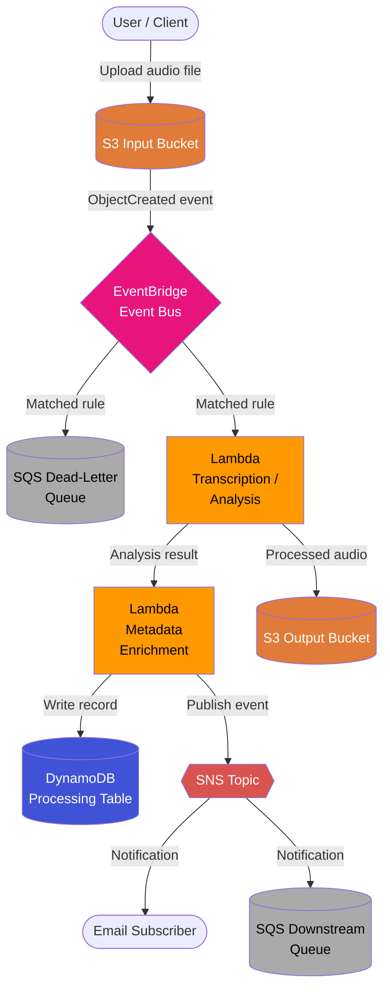

# Architecture: Sleep Audio Pipeline

## Overview

This project implements an **event-driven sleep audio pipeline** on AWS, built with TypeScript CDK following strict TDD practices. The pipeline ingests raw audio files, processes them asynchronously, and delivers metadata and notifications to downstream consumers.

## Pipeline Description

### 1. Ingestion (S3)

A dedicated **S3 input bucket** receives raw sleep audio files (e.g., `.mp3`, `.wav`, `.ogg`). Object-level event notifications are configured to publish `ObjectCreated` events to **EventBridge** via an S3 notification rule.

### 2. Event Routing (EventBridge)

An **EventBridge event bus** receives the S3 object creation events. An EventBridge rule matches on the source bucket and key prefix, then routes events to the processing layer. This decouples producers from consumers and enables fine-grained filtering without polling.

### 3. Processing Layer (Lambda)

One or more **Lambda functions** are triggered by EventBridge:

- **Transcription / Analysis Lambda** – Calls Amazon Transcribe or a third-party ML model to analyse the audio (e.g., detect sleep-stage markers, ambient noise level).
- **Metadata Enrichment Lambda** – Augments the raw transcription result with user-provided metadata and writes a structured record to **DynamoDB**.
- **Output Generation Lambda** – Produces a processed audio artefact (trimmed, normalised, or annotated) and writes it to a separate **S3 output bucket**.

Each Lambda is idempotent and retries are handled by EventBridge's built-in retry policy and a dead-letter queue (DLQ) backed by **SQS**.

### 4. Persistence (DynamoDB)

A **DynamoDB table** stores per-file processing results using the S3 object key as the partition key. GSIs enable querying by user or processing status.

### 5. Notifications (SNS)

An **SNS topic** publishes completion or failure notifications. Subscribers can include email endpoints, SQS queues for downstream systems, or additional Lambda functions.

---

## Mermaid Diagram

---

## Key Design Decisions

| Decision | Choice | Rationale |
|---|---|---|
| Event bus | EventBridge | Native S3 integration, rich filtering, zero polling |
| Compute | Lambda | Serverless, pay-per-use, auto-scaling |
| Persistence | DynamoDB | Serverless, single-digit ms latency, flexible schema |
| Fan-out | SNS | Decoupled multi-subscriber notifications |
| Error handling | SQS DLQ | Durable capture of failed events for replay |
| IaC | AWS CDK L2/L3 | Type-safe, composable, high-level abstractions |

---

> **Note:** This diagram and description must be kept perfectly in sync with the CDK stack definitions after every change. See [CONTRIBUTING.md](./CONTRIBUTING.md) for the update protocol.
