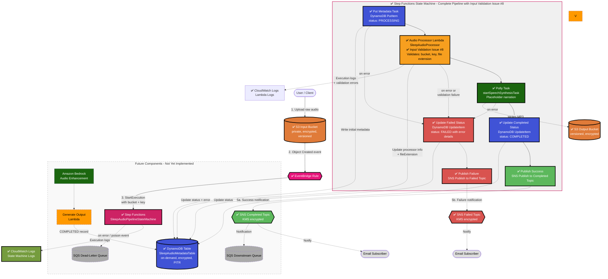

# Architecture: Event-Driven Sleep Audio Pipeline (Target Design)

> **Status:** This document describes the **intended target architecture** and is the
> **single source of truth** for every future issue and pull request. It is a living design
> spec, not a reflection of what is currently deployed. See the
> [Implementation Status](#implementation-status) section for the current state of the CDK
> stack. No CDK stack code is written for this design issue — implementation begins in
> subsequent TDD issues, starting with *"[3] TDD: Core S3 Buckets + EventBridge Rule"*.

---

## 1. High-Level Overview

The **Sleep Audio Pipeline** is a fully serverless, event-driven system on AWS, built with
TypeScript AWS CDK following strict Test-Driven Development. Users upload raw audio (voice
recordings, ambient sounds) to an input **S3 bucket**. Each upload emits an event that is
routed by **EventBridge** to an **AWS Step Functions** state machine, which orchestrates the
processing workflow: validation and metadata extraction, optional **Amazon Polly**
text-to-speech (soothing narration) and optional **Amazon Bedrock** AI audio enhancement /
generation. Processed artifacts land in a versioned output **S3 bucket**, processing metadata
is persisted to **DynamoDB**, and completion or error notifications are fanned out via **SNS**.

Design goals:

- **Decoupled & asynchronous** — producers (uploads) never block on processing.
- **Orchestrated** — Step Functions makes the multi-step workflow explicit, retryable, and
  observable, rather than chaining Lambdas implicitly.
- **Secure by default** — least-privilege IAM, encryption at rest and in transit, private
  buckets with public access blocked.
- **Observable** — structured CloudWatch Logs, metrics, and alarms on failures.
- **Multi-environment** — `dev` / `stage` / `prod` driven by CDK context, with no hard-coded
  account IDs or secrets.

---

## 2. Implementation Status

| Component | Status | CDK construct / file |
|---|---|---|
| Architecture & design docs | ✅ Done | `ARCHITECTURE.md` |
| CDK app skeleton | ✅ Done | `bin/cdk-base.ts`, `lib/cdk-base-stack.ts` |
| Jest + assertions setup | ✅ Done | `test/cdk-base.test.ts` |
| CI workflow | ✅ Done | `.github/workflows/ci.yml` |
| Multi-environment context (dev/stage/prod) | ⬜ Not started | — |
| S3 Input Bucket | ✅ Done (Issue #3) | `lib/cdk-base-stack.ts` (SleepAudioInputBucket) |
| EventBridge Rule (S3 → Step Functions) | ✅ Done (Issue #3) | `lib/cdk-base-stack.ts` (S3ObjectCreatedRule) |
| Step Functions Orchestrator | ✅ Done (Issues #4, #6, #7, #8) | `lib/cdk-base-stack.ts` (SleepAudioPipelineStateMachine) |
| Lambda – Audio Processor with Input Validation | ✅ Done (Issues #7, #8) | `lib/cdk-base-stack.ts` (SleepAudioProcessor), `lambda/sleep-audio-processor/` |
| Amazon Polly Integration (TTS) | ✅ Done (Issue #4, skeleton) | `lib/cdk-base-stack.ts` (PollyTask) |
| Amazon Bedrock Integration (enhancement) | ⬜ Not started | — |
| Lambda – Output Generation | ⬜ Not started | — |
| DynamoDB Metadata Table | ✅ Done (Issue #5) | `lib/cdk-base-stack.ts` (SleepAudioMetadataTable) |
| S3 Output Bucket (versioned) | ✅ Done (Issue #3) | `lib/cdk-base-stack.ts` (SleepAudioOutputBucket) |
| SNS Notification Topics | ✅ Done (Issue #6) | `lib/cdk-base-stack.ts` (SleepAudioPipelineCompletedTopic, SleepAudioPipelineFailedTopic) |
| Complete Pipeline Wiring & Input Validation | ✅ Done (Issue #8) | All components integrated end-to-end |
| SQS Dead-Letter Queue | ⬜ Not started | — |
| CloudWatch Alarms | ⬜ Not started | — |

> This table **must** be updated in the same commit as every infrastructure change.

---

## 3. Data Flow

1. **Upload** — A user (or client app) uploads a raw audio file to the **S3 input bucket**
   under a per-user key prefix (e.g. `uploads/<user_id>/<filename>.wav`).
2. **Event detection** — S3 emits an `Object Created` event. With S3 EventBridge
   notifications enabled, the event is delivered to the default **EventBridge** event bus.
3. **Routing** — An **EventBridge rule** matches `Object Created` events for the input bucket
   (filtered by prefix/suffix) and starts an execution of the **Step Functions** state
   machine, passing the bucket name and object key as input.
4. **Orchestrated processing** — The Step Functions workflow runs the steps below, with
   built-in retries and a `Catch` path that records failures and notifies via SNS:
   - **Initial metadata write (DynamoDB PutItem)** — Write an initial `PROCESSING` record to DynamoDB with audioId, bucket, key, and timestamps.
   - **Process audio metadata (Lambda - SleepAudioProcessor)** — A Lambda task validates input, logs the input, enriches metadata, and updates DynamoDB with processing details. **Input validation** (Issue #8) ensures:
     - Required fields (bucket, key) are present and valid
     - File extension is supported (.mp3, .wav, .m4a, .ogg, .flac)
     - Validation errors are caught and trigger the error path
   - **Generate soothing voice (Amazon Polly)** — Optionally synthesise narration / guided
     sleep audio from supplied text using Polly, writing the synthesised speech to the output
     bucket.
   - **Enhance / generate audio (Amazon Bedrock)** — Optionally call a Bedrock model to
     enhance the audio or generate AI sleep soundscapes.
   - **Update status (DynamoDB UpdateItem)** — Update the DynamoDB record status to `COMPLETED` with timestamp.
   - **Publish success notification (SNS)** — Send completion notification with audioId and metadata.
5. **Notify** — On success or failure the workflow publishes a message to the **SNS topic**;
   subscribers (email, SQS, downstream Lambdas) react accordingly.
6. **Error handling** — Any task failure (including validation failures) triggers the error path: update DynamoDB status to `FAILED` with error details, then publish failure notification to SNS. Failed asynchronous invocations and unmatched/poison events are captured in an **SQS dead-letter queue** (future) for inspection and replay.

---

## 4. Implemented Core Components (Issues #3, #4, #5, #6, #7, and #8)

The following foundational components are now implemented and tested:

### S3 Input Bucket (SleepAudioInputBucket)
- **Encryption**: S3-managed encryption (SSE-S3) at rest
- **Versioning**: Enabled to track all changes and prevent data loss
- **Public Access**: Completely blocked (all four public access settings enabled)
- **EventBridge Integration**: Enabled to emit Object Created events to the default event bus
- **SSL Enforcement**: Bucket policy denies all non-HTTPS requests
- **Retention**: RETAIN policy protects against accidental deletion

### S3 Output Bucket (SleepAudioOutputBucket)
- **Encryption**: S3-managed encryption (SSE-S3) at rest
- **Versioning**: Enabled to protect processed outputs and enable rollback
- **Public Access**: Completely blocked
- **SSL Enforcement**: Bucket policy denies all non-HTTPS requests
- **Retention**: RETAIN policy protects against accidental deletion

### EventBridge Rule (S3ObjectCreatedRule)
- **Event Pattern**: Matches `Object Created` events from the input bucket
- **State**: Enabled and ready to route events
- **Target**: Routes to Step Functions state machine
- **Input Transformation**: Extracts bucket name and object key from S3 event and passes to state machine
- **Description**: Documents the rule's purpose for future maintainers

### Step Functions State Machine (SleepAudioPipelineStateMachine) - Issues #4, #5, #6, and #7
- **Orchestration**: Manages the audio processing workflow with built-in retries and error handling
- **Definition**: Enhanced workflow with error handling and Lambda integration:
  - Success path: Start → Put Metadata → Audio Processor Lambda → Polly Task → Update Completed Status → Publish Success → End
  - Error path: (on any error) → Update Failed Status → Publish Failure → End
- **Error Handling (Issue #6)**: 
  - Catch blocks on Put Metadata, Audio Processor Lambda, and Polly tasks capture all errors
  - Error details captured in `$.error` path
  - Failed executions update DynamoDB status to `FAILED` with error details
  - All errors trigger SNS failure notifications
- **Status Updates (Issue #6)**:
  - Initial status: `PROCESSING` (from Put Metadata task)
  - Success status: `COMPLETED` (via DynamoDB UpdateItem)
  - Failure status: `FAILED` (via DynamoDB UpdateItem with error details)
  - Status updates include `updatedAt` timestamp
- **CloudWatch Logs**: Full execution logging enabled (level: ALL, includes execution data)
- **IAM Role**: Execution role with least-privilege permissions for:
  - DynamoDB: PutItem and UpdateItem operations
  - Lambda: InvokeFunction (for SleepAudioProcessor)
  - Polly: startSpeechSynthesisTask
  - S3: Write access to output bucket
  - SNS: Publish to notification topics
  - KMS: Decrypt/encrypt using SNS encryption key
- **DynamoDB Integration (Issue #5)**: Initial task state that writes metadata record to DynamoDB
  - Stores audioId (partition key), status, inputBucket, inputKey, createdAt, updatedAt
  - Status set to `PROCESSING` when workflow starts
  - Status updated to `COMPLETED` or `FAILED` based on workflow outcome
- **Lambda Integration (Issue #7)**: Task state that invokes SleepAudioProcessor Lambda function
  - Receives bucket, key, and audioId as input
  - Returns enriched metadata and processing status
  - Updates DynamoDB with processor and timestamp information
  - Placeholder for future validation, metadata extraction, or audio processing logic
- **Polly Integration**: Task state that invokes `polly:startSpeechSynthesisTask` with placeholder parameters
  - Output format: MP3
  - Voice: Joanna (neural voice)
  - Text: Placeholder narration text
  - Output location: S3 output bucket
- **Event-Driven**: Triggered automatically by EventBridge rule on S3 uploads
- **Input**: Receives bucket name and object key from EventBridge event

### Lambda Function - SleepAudioProcessor (Issues #7 and #8)
- **Runtime**: Node.js 20.x (TypeScript)
- **Handler**: `index.handler`
- **Code Location**: `lambda/sleep-audio-processor/`
- **Purpose**: Audio processing Lambda with input validation
  - **Input Validation (Issue #8)**:
    - Validates required fields: bucket and key must be present and non-empty
    - Validates file extension: only supports .mp3, .wav, .m4a, .ogg, .flac
    - Returns clear error messages for validation failures
    - Validation errors trigger the state machine error path
  - Logs input for observability
  - Updates DynamoDB with processing metadata (processor, processedAt, fileExtension)
  - Returns enriched metadata with processing status
  - Future enhancements: Audio metadata extraction, file size validation, duration analysis
- **Environment Variables**:
  - `TABLE_NAME`: DynamoDB table name for metadata storage
- **Timeout**: 60 seconds
- **IAM Permissions**: Execution role with least-privilege access:
  - DynamoDB: Read and write access to metadata table (GetItem, UpdateItem, PutItem, DeleteItem, Scan, Query)
  - CloudWatch Logs: Basic execution role (CreateLogGroup, CreateLogStream, PutLogEvents)
- **Integration**: Invoked by Step Functions state machine as a task between Put Metadata and Polly tasks
- **Error Handling**: All errors (including validation failures) are caught by state machine and trigger the error path
- **Observability**: All invocations logged to CloudWatch Logs with input/output details

### SNS Notification Topics (Issue #6)
- **Completed Topic** (SleepAudioPipelineCompletedTopic):
  - Display Name: "Sleep Audio Pipeline Completed"
  - Encrypted using dedicated KMS key with key rotation enabled
  - Publishes success notifications with: status, audioId, inputBucket, inputKey, completedAt
  - Triggered at end of successful workflow execution
- **Failed Topic** (SleepAudioPipelineFailedTopic):
  - Display Name: "Sleep Audio Pipeline Failed"
  - Encrypted using same KMS key as Completed topic
  - Publishes failure notifications with: status, audioId, inputBucket, inputKey, error, failedAt
  - Triggered when any error occurs in the workflow (Put Metadata or Polly task failures)
- **KMS Encryption**:
  - Dedicated KMS key (SnsEncryptionKey) with automatic key rotation
  - Least-privilege key policy: State machine has decrypt/encrypt permissions
  - Retain policy to prevent accidental deletion
- **IAM**: State machine has scoped SNS:Publish permission on both topics

### DynamoDB Metadata Table (SleepAudioMetadataTable) - Issue #5
- **Partition Key**: `audioId` (string) — unique identifier for each audio processing job
- **Attributes**: Stores status, inputBucket, inputKey, createdAt, updatedAt
- **Billing Mode**: On-demand (PAY_PER_REQUEST) — no capacity planning required
- **Encryption**: AWS-managed server-side encryption (SSE) at rest
- **Point-in-Time Recovery**: Enabled for data protection and recovery
- **Retention**: RETAIN policy protects against accidental deletion
- **IAM**: State machine has scoped DynamoDB:PutItem permission on this table

All components follow AWS best practices:
- Least-privilege IAM (scoped permissions for each service)
- Encryption at rest and in transit
- Private by default (no public access)
- Infrastructure as code with comprehensive test coverage (30 passing tests)
- Observable via CloudWatch Logs and Step Functions execution history

### Notification and Error Handling Layer (Issue #6)

The state machine now includes comprehensive error handling and notification capabilities:

**Error Handling Flow:**
- All critical tasks (Put Metadata, Polly Task) have Catch blocks that capture errors
- Error details are captured in the `$.error` path for debugging and audit
- Failed executions automatically transition to error handling path

**Status Tracking:**
- `PROCESSING`: Set when workflow starts (initial Put Metadata task)
- `COMPLETED`: Set when workflow completes successfully (before success notification)
- `FAILED`: Set when any error occurs (before failure notification)
- All status updates include `updatedAt` timestamp; failures also include error details

**Notifications:**
- **Success Path**: After successful processing, updates status to `COMPLETED` and publishes to Completed SNS topic
- **Failure Path**: On any error, updates status to `FAILED` (with error details) and publishes to Failed SNS topic
- Both topics are encrypted using a dedicated KMS key with automatic key rotation
- Notification messages include: status, audioId, bucket/key, timestamp, and error details (for failures)

**Security:**
- SNS topics encrypted using dedicated KMS key with key rotation enabled
- State machine has scoped SNS:Publish permission only on these specific topics
- State machine has KMS decrypt/encrypt permissions for SNS encryption key
- All error details are captured but no sensitive data is exposed in notifications

All components follow AWS best practices:
- Least-privilege IAM (scoped permissions for each service)
- Encryption at rest and in transit
- Private by default (no public access)
- Infrastructure as code with comprehensive test coverage (65 passing tests)
- Observable via CloudWatch Logs and Step Functions execution history
- Resilient error handling with automatic status updates and notifications

### Complete Pipeline Integration and Input Validation (Issue #8)

Issue #8 completed the pipeline wiring and added input validation to ensure a clean end-to-end flow. This is a **milestone issue** that brings all previously created components together into a functionally connected skeleton pipeline.

**Pipeline Wiring Verification:**
- EventBridge rule correctly triggers Step Functions state machine with bucket and key from S3 events
- State machine orchestrates the complete flow: DynamoDB → Lambda → Polly → Status Updates → SNS
- All service-to-service hand-offs (input/output mapping) are correctly configured
- IAM permissions verified across all components with least-privilege principles

**Input Validation Implementation:**
- Lambda function validates required fields (bucket, key) and rejects empty/missing values
- Lambda function validates audio file format: only accepts .mp3, .wav, .m4a, .ogg, .flac
- Clear error messages returned for validation failures
- Validation errors trigger the state machine error path:
  - DynamoDB status updated to `FAILED` with error details
  - SNS failure notification published
  - CloudWatch logs capture full error context

**End-to-End Flow - Success Path:**
1. User uploads audio file (e.g., `sleep-story.mp3`) to S3 input bucket
2. EventBridge detects Object Created event and starts state machine execution
3. State machine writes initial `PROCESSING` metadata to DynamoDB
4. Lambda validates input (checks bucket, key, file extension)
5. Lambda enriches metadata and updates DynamoDB with processor info
6. Polly task generates speech synthesis (placeholder)
7. State machine updates DynamoDB status to `COMPLETED`
8. Success notification published to SNS Completed topic
9. All steps logged to CloudWatch for observability

**End-to-End Flow - Failure Path:**
1. User uploads invalid file (e.g., `document.pdf`) to S3 input bucket
2. EventBridge starts state machine execution
3. State machine writes initial `PROCESSING` metadata to DynamoDB
4. Lambda validates input and rejects unsupported format
5. Lambda throws validation error
6. State machine Catch block captures error
7. State machine updates DynamoDB status to `FAILED` with error details
8. Failure notification published to SNS Failed topic with error context
9. All error details logged to CloudWatch

**Test Coverage:**
- 65 passing tests verify the complete integrated pipeline
- Tests cover input validation logic (required fields, file extensions)
- Tests verify complete workflow from EventBridge through to SNS notifications
- Tests ensure all IAM permissions are correctly configured
- Tests validate error handling paths and DynamoDB status updates
- Snapshot test captures the complete synthesized CloudFormation template

---

## 5. Key AWS Services & Rationale

| Concern | Service | Why it was chosen |
|---|---|---|
| Ingestion / storage | **Amazon S3** | Durable (11 nines), cheap object storage; native EventBridge integration; output bucket uses **versioning** to protect against overwrites and enable rollback. |
| Event routing | **Amazon EventBridge** | Native S3 event source, content-based filtering, zero polling, easy fan-out and decoupling of producers from consumers. |
| Orchestration | **AWS Step Functions** | Makes the multi-step workflow explicit and auditable; built-in retries, error catching, timeouts, and visual execution history; preferred over implicit Lambda chaining. |
| Compute | **AWS Lambda** | Serverless, pay-per-use, auto-scaling task workers invoked by Step Functions for validation, metadata, and output generation. |
| Text-to-speech | **Amazon Polly** | Managed neural TTS for generating soothing narration / guided-sleep voice without managing models. |
| AI audio | **Amazon Bedrock** | Managed foundation-model access for optional audio enhancement or AI-generated sleep soundscapes, no model hosting required. |
| Metadata persistence | **Amazon DynamoDB** | Serverless, single-digit-ms latency, flexible schema; partition by `user_id`, sort by upload timestamp / object key; GSI for querying by processing status. |
| Notifications | **Amazon SNS** | Decoupled multi-subscriber pub/sub for completion and error notifications. |
| Reliability | **Amazon SQS (DLQ)** | Durable capture of failed/poison events for inspection and replay. |
| Observability | **Amazon CloudWatch** | Logs, metrics, and alarms across Lambda, Step Functions, and DynamoDB. |
| IaC | **AWS CDK (L2/L3, TypeScript)** | Type-safe, composable, high-level constructs; testable with `aws-cdk-lib/assertions`. |

---

## 6. Mermaid Diagram

> **Note**: Components marked with ✅ are **implemented and tested** (Issues #3–#8). Issue #8 completed pipeline wiring and input validation. Components without ✅ are planned for future issues.

**Legend:**
- ✅ = Implemented and tested (Issues #3, #4, #5, and #6)
- Solid boxes with thick border = Fully implemented and wired components
- Solid arrows = Active data flow paths
- Dashed arrows = Error paths and auxiliary flows (implemented in Issue #6)
- Dashed boxes = Planned for future implementation
- Current state machine: 
  - Success path: Start → Put Metadata → Polly Task → Update Completed Status → Publish Success → End
  - Error path: (on error) → Update Failed Status → Publish Failure → End
- Full workflow logic will be added in subsequent issues

---

## 7. Security

- **Private buckets** — Both S3 buckets block all public access; access only via IAM roles.
- **Encryption at rest** — S3 (SSE-KMS or SSE-S3), DynamoDB, SNS, and SQS all encrypted.
- **Encryption in transit** — TLS enforced; bucket policies deny non-HTTPS (`aws:SecureTransport`) requests.
- **Least-privilege IAM** — Each Lambda / Step Functions task gets a scoped role granting only
  the specific actions and ARNs it needs (e.g. `s3:GetObject` on the input bucket,
  `s3:PutObject` on the output bucket, `dynamodb:PutItem`/`UpdateItem` on the table, scoped
  `polly:SynthesizeSpeech` and `bedrock:InvokeModel`). No wildcard `*` resources or actions.
- **No hard-coded secrets** — Configuration via CDK context / SSM Parameter Store; no account
  IDs or credentials committed to source.
- **Output versioning** — Versioning on the output bucket guards against accidental
  overwrite/deletion and supports recovery.

---

## 8. Observability

- **Structured logging** — Lambda and Step Functions emit JSON logs to **CloudWatch Logs**
  with bounded retention per environment.
- **Step Functions execution history** — Full visual audit trail of every workflow run.
- **Metrics & alarms** — CloudWatch alarms on Lambda errors/throttles, Step Functions
  `ExecutionsFailed`, DLQ `ApproximateNumberOfMessagesVisible > 0`, and DynamoDB throttling.
- **Tracing** — AWS X-Ray tracing enabled across Lambda and Step Functions for end-to-end
  latency analysis (future enhancement).

---

## 9. Cost Considerations

- **Pay-per-use** — All services are serverless; there is no idle compute cost.
- **DynamoDB on-demand** billing avoids provisioning for unpredictable workloads.
- **S3 lifecycle rules** can transition older raw uploads to Infrequent Access / Glacier and
  expire incomplete multipart uploads.
- **Optional AI steps** — Polly and Bedrock are invoked only when requested, so cost scales
  with actual usage.
- **Log retention** is bounded per environment to control CloudWatch storage costs.

---

## 10. Multi-Environment Support

Environments (`dev`, `stage`, `prod`) are selected via **CDK context** (e.g.
`npx cdk synth -c env=stage`). Each environment derives its own resource names, removal
policies, log retention, and alarm thresholds from a single context-driven configuration, so
the same stack code deploys safely to every account/region without modification.

---

## 11. Future Extensibility

- Add audio formats and richer validation (codec, sample-rate checks).
- Introduce a real-time API (API Gateway + WebSockets) for upload status.
- Fan out additional Step Functions branches (e.g. transcription, sleep-stage analysis).
- Add a CloudFront distribution for secure, low-latency delivery of processed audio.
- Expand DynamoDB GSIs for analytics and per-user history queries.

---

## 12. Key Design Decisions

| Decision | Choice | Rationale |
|---|---|---|
| Event bus | EventBridge | Native S3 integration, rich filtering, zero polling |
| Orchestration | Step Functions | Explicit, retryable, auditable multi-step workflow |
| Compute | Lambda | Serverless, pay-per-use, auto-scaling task workers |
| TTS / AI | Polly + Bedrock | Managed, optional, no model hosting |
| Persistence | DynamoDB | Serverless, low latency, flexible schema |
| Output durability | S3 versioning | Protects against overwrite/deletion, enables rollback |
| Fan-out | SNS | Decoupled multi-subscriber notifications |
| Error handling | SQS DLQ | Durable capture of failed events for replay |
| IaC | AWS CDK L2/L3 | Type-safe, composable, high-level abstractions |

---

> **Note:** This diagram and description are the source of truth and must be kept perfectly in
> sync with the CDK stack definitions after every change. See
> [CONTRIBUTING.md](./CONTRIBUTING.md) and
> [.github/AGENT_GUIDELINES.md](./.github/AGENT_GUIDELINES.md) for the update protocol.
