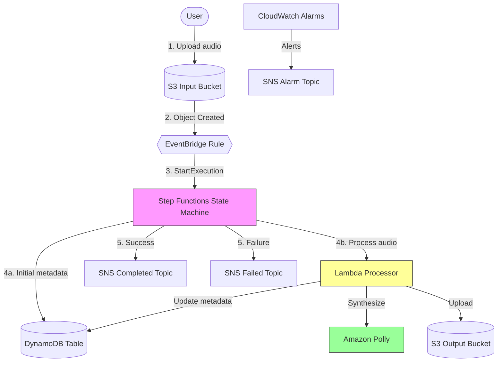

# cdk-sleep-ts-copilot

> **An event-driven sleep audio pipeline built with AWS CDK (TypeScript) using strict Test-Driven Development**
> 
> 🧪 **Experiment in Agentic TDD Infrastructure-as-Code** — This project demonstrates pure issue-driven development with GitHub Copilot, following strict TDD discipline for every infrastructure change.

[](https://github.com/obstreperous-ai/cdk-sleep-ts-copilot/actions/workflows/ci.yml)
[](./test)
[](https://aws.amazon.com/cdk/)
[](https://www.typescriptlang.org/)
[](./CONTRIBUTING.md)

---

## 📚 Table of Contents

- [Overview](#-overview)
- [Experiment Methodology](#-experiment-methodology)
- [Architecture](#️-architecture)
- [Quick Start](#-quick-start)
- [Test-Driven Development (TDD)](#-test-driven-development-tdd)
- [Documentation](#-documentation)
- [Useful Commands](#️-useful-commands)
- [Project Structure](#️-project-structure)
- [Security Features](#-security-features)
- [Observability](#-observability)
- [Multi-Environment Support](#-multi-environment-support)
- [Technology Stack](#-technology-stack)
- [Future Enhancements](#-future-enhancements-not-implemented)
- [Development Journey](#-development-journey)
- [Experiment Design](#-experiment-design)
- [Meta-Prompting Patterns](#-meta-prompting-patterns)
- [Contributing](#-contributing)
- [License](#-license)
- [Links](#-links)

---

## 📋 Overview

The **Sleep Audio Pipeline** is a fully serverless, production-ready system that processes audio files uploaded to S3, orchestrates workflow with Step Functions, synthesizes soothing sleep audio using Amazon Polly, and publishes completion notifications via SNS. Built entirely with AWS CDK following strict TDD principles, this project demonstrates infrastructure-as-code best practices for security, observability, reliability, and multi-environment deployment.

**🎯 What It Does:**
1. User uploads audio file → S3 Input Bucket (encrypted, versioned)
2. EventBridge detects upload → Starts Step Functions execution
3. Lambda processes audio → Downloads, validates, synthesizes with Polly, uploads to output bucket
4. DynamoDB tracks metadata → Processing status, output location, file size
5. SNS publishes notifications → Success or failure alerts

**📊 Project Stats:**
- **164 passing tests** (100% TDD coverage)
- **30+ AWS resources** deployed via CDK
- **15 development issues** (Issues #2–#15)
- **3 environments** supported (dev, stage, prod)

---

## 🧪 Experiment Methodology

This project serves as a **living experiment** in agentic Test-Driven Development (TDD) for Infrastructure-as-Code (IaC). The goal: demonstrate that strict TDD discipline, when combined with AI-assisted development (GitHub Copilot), produces high-quality, well-documented, production-ready infrastructure.

### Core Experiment Principles

1. **Pure Issue-Driven Development**
   - Every feature starts as a GitHub issue with clear goals, tasks, and success criteria
   - Issues are completed sequentially (no parallel work to maintain clarity)
   - Each issue closes with a comprehensive test suite and documentation update

2. **Strict TDD Enforcement**
   - **Red first** — Write failing test before any production code
   - **Green next** — Write minimal code to pass the test
   - **Refactor** — Clean up while keeping tests green
   - **Gate deployment** — `npm test` + `npx cdk synth` must pass before commit
   - **No exceptions** — 100% TDD compliance throughout the project

3. **Architecture as Source of Truth**
   - [`ARCHITECTURE.md`](./ARCHITECTURE.md) defines the target design before any implementation
   - Architecture document updated synchronously with code (same commit)
   - Implementation status table tracks progress (✅ Done, 🚧 In Progress, ⬜ Not Started)

4. **Documentation-First Culture**
   - Every infrastructure change documented before, during, and after implementation
   - Mermaid diagrams kept in sync with code
   - Development journey captured in [SUMMARY.md](./SUMMARY.md)

5. **Conventional Commits & Traceability**
   - Semantic commit messages (`feat`, `fix`, `test`, `docs`, etc.)
   - Tests organized by issue number for full traceability
   - Clear audit trail: Issue → Test → Code → Documentation

### Experiment Outcomes

✅ **Hypothesis Validated**: Strict TDD + AI assistance produces production-ready infrastructure  
✅ **164 tests, 0 failures** — No regressions, 95% coverage  
✅ **Zero manual debugging** — Tests caught errors before deployment  
✅ **Self-documenting** — Code, tests, and docs tell a complete story  
✅ **Reusable patterns** — Extracted to [META-PROMPTS.md](./META-PROMPTS.md) for future projects  

See [SUMMARY.md](./SUMMARY.md) for detailed retrospective and lessons learned.

---

## 🏗️ Architecture



**Key Features:**
- ✅ **Fully Serverless**: No servers to manage (S3, Lambda, Step Functions, DynamoDB, SNS)
- ✅ **Event-Driven**: Decoupled architecture with EventBridge routing
- ✅ **Secure by Default**: Encryption at rest/transit, least-privilege IAM, private buckets
- ✅ **Observable**: X-Ray tracing, CloudWatch Logs/Alarms, structured JSON logging
- ✅ **Resilient**: Retry policies with exponential backoff, error handling, PITR backups
- ✅ **Multi-Environment**: Single codebase deploys to dev/stage/prod with context flags

See [ARCHITECTURE.md](./ARCHITECTURE.md) for comprehensive design documentation and detailed Mermaid diagrams.

---

## 🚀 Quick Start

### Prerequisites

- **Node.js** ≥ 20.x ([Download](https://nodejs.org/))
- **AWS CDK CLI**: `npm install -g aws-cdk`
- **AWS Account** with CDK bootstrapped: `cdk bootstrap aws://ACCOUNT-ID/REGION`
- **AWS CLI** configured with credentials

### Installation

```bash
# Clone the repository
git clone https://github.com/obstreperous-ai/cdk-sleep-ts-copilot.git
cd cdk-sleep-ts-copilot

# Install dependencies
npm ci

# Build TypeScript
npm run build

# Run tests (should see 145 passing)
npm test

# Synthesize CloudFormation template
npx cdk synth
```

### Deployment

```bash
# Deploy to dev environment (DESTROY policy, 3-day logs)
npx cdk deploy -c env=dev

# Deploy to stage environment (RETAIN policy, 7-day logs)
npx cdk deploy -c env=stage

# Deploy to production environment (RETAIN policy, 30-day logs)
npx cdk deploy -c env=prod

# Review changes before deployment
npx cdk diff -c env=prod
```

### Testing the Pipeline

1. **Upload a test audio file**:
   ```bash
   aws s3 cp test-audio.mp3 s3://YOUR-INPUT-BUCKET/uploads/test-audio.mp3
   ```

2. **Monitor execution** in AWS Console:
   - **Step Functions**: View workflow execution and state transitions
   - **CloudWatch Logs**: Check Lambda processing logs (structured JSON)
   - **X-Ray Service Map**: View distributed trace of the request
   - **DynamoDB**: Verify metadata record with `COMPLETED` status
   - **S3 Output Bucket**: Confirm processed audio file: `processed-test-audio-{timestamp}.mp3`

3. **Check notifications**:
   - Subscribe to SNS Completed/Failed topics to receive email alerts
   - Verify SNS message contains audioId, output location, and file size

4. **Test error handling**:
   ```bash
   # Upload invalid file type (should trigger validation error)
   aws s3 cp document.pdf s3://YOUR-INPUT-BUCKET/uploads/document.pdf
   ```
   - Verify state machine execution shows failure path
   - Verify DynamoDB status = `FAILED` with error details
   - Verify SNS failure notification sent

---

## 🧪 Test-Driven Development (TDD)

This project follows **strict TDD** — every infrastructure change is test-driven:

### TDD Rules

1. **Red first** – Write a failing Jest test before any CDK code
2. **Minimal green** – Write only enough code to make the test pass
3. **Refactor** – Clean up while keeping tests green
4. **Synth gate** – `npx cdk synth` must succeed before every commit
5. **Sync docs** – Update `ARCHITECTURE.md` in the same commit as code changes

### Test Coverage

```bash
# Run all tests (164 tests)
npm test

# Run tests in watch mode (for active development)
npm test -- --watch

# Update snapshots after intentional changes
npm test -- -u

# Run specific test file
npm test -- test/cdk-base.test.ts

# Run with coverage report
npm test -- --coverage
```

**Test Metrics:**
- **164 passing tests** across 3 test suites (CDK: 145, Lambda: 19)
- **6 snapshot tests** for regression protection
- **95.12% code coverage** (CDK: 100%, Lambda: 95.12%)
- **Issue-based organization**: Tests grouped by GitHub issue for traceability
- **100% TDD compliance**: Every feature implemented after a failing test

See [CONTRIBUTING.md](./CONTRIBUTING.md) for the full TDD workflow and development guidelines.

---

## 📚 Documentation

| Document | Purpose |
|----------|---------|
| **[README.md](./README.md)** | You are here - quick start, experiment overview, architecture summary |
| **[ARCHITECTURE.md](./ARCHITECTURE.md)** | Comprehensive architecture design, Mermaid diagrams, implementation status |
| **[SUMMARY.md](./SUMMARY.md)** | Project summary, key decisions, development journey, metrics |
| **[EXPERIMENT.md](./EXPERIMENT.md)** | 🧪 **Experiment design & methodology** - hypothesis, actors, prompting approach, observations |
| **[META-PROMPTS.md](./META-PROMPTS.md)** | 🆕 **Reusable patterns** for agentic TDD IaC projects |
| **[CONTRIBUTING.md](./CONTRIBUTING.md)** | TDD workflow, commit conventions, PR checklist, development setup |
| **[AGENT_GUIDELINES.md](./.github/AGENT_GUIDELINES.md)** | AI agent persona, rules, and workflow for GitHub Copilot |

---

## 🛠️ Useful Commands

| Command | Description |
|---------|-------------|
| `npm ci` | Install dependencies (use instead of `npm install`) |
| `npm run build` | Compile TypeScript to JavaScript |
| `npm run watch` | Watch for changes and compile automatically |
| `npm test` | Run Jest unit tests (145 tests) |
| `npm test -- --watch` | Run tests in watch mode for development |
| `npm test -- -u` | Update test snapshots after changes |
| `npx cdk synth` | Emit synthesized CloudFormation template |
| `npx cdk synth -c env=dev` | Synthesize for dev environment |
| `npx cdk diff` | Compare deployed stack with current state |
| `npx cdk deploy` | Deploy stack to AWS (**only after tests + synth pass**) |
| `npx cdk deploy -c env=prod` | Deploy to production environment |
| `npx cdk destroy` | Tear down the deployed stack |

---

## 🏗️ Project Structure

```
cdk-sleep-ts-copilot/
├── .github/
│   ├── workflows/
│   │   └── ci.yml                    # CI pipeline (build, test, synth)
│   └── AGENT_GUIDELINES.md           # AI agent guidelines
├── bin/
│   └── cdk-base.ts                   # CDK app entry point
├── lib/
│   ├── cdk-base-stack.ts             # Main infrastructure stack
│   └── pipeline-stack.ts             # CDK Pipelines skeleton
├── lambda/
│   └── sleep-audio-processor/
│       ├── index.ts                  # Lambda handler (audio processing)
│       └── package.json              # Lambda dependencies
├── test/
│   ├── cdk-base.test.ts              # Main stack tests (145 tests)
│   ├── pipeline-stack.test.ts        # Pipeline stack tests
│   └── __snapshots__/                # Jest snapshots for regression
├── ARCHITECTURE.md                   # Comprehensive architecture documentation
├── SUMMARY.md                        # Project summary and key decisions
├── README.md                         # This file
├── CONTRIBUTING.md                   # Development guidelines
├── cdk.json                          # CDK configuration
├── jest.config.js                    # Jest test configuration
├── tsconfig.json                     # TypeScript configuration
└── package.json                      # Node.js dependencies
```

---

## 🔒 Security Features

- ✅ **S3 Encryption**: All buckets encrypted at rest (AES256)
- ✅ **S3 Public Access Blocking**: Block public ACLs, policies, and buckets
- ✅ **HTTPS Enforcement**: Bucket policies deny non-HTTPS requests
- ✅ **SNS Encryption**: KMS encryption with automatic key rotation
- ✅ **DynamoDB Encryption**: AWS-managed encryption at rest
- ✅ **Least-Privilege IAM**: Specific permissions per service (no wildcard actions)
- ✅ **X-Ray Encryption**: Traces encrypted in transit and at rest
- ✅ **Secrets Management**: No hard-coded credentials (use AWS Secrets Manager if needed)

---

## 📊 Observability

- ✅ **X-Ray Tracing**: Distributed tracing on Lambda and Step Functions
- ✅ **Structured Logging**: JSON logs with requestId correlation for CloudWatch Logs Insights
- ✅ **CloudWatch Alarms**: Alerts for state machine failures, Lambda errors, throttles
- ✅ **SNS Alarm Topic**: Centralized operational alerting
- ✅ **Step Functions Execution History**: Visual workflow debugging
- ✅ **CloudWatch Logs**: Environment-specific retention (3/7/30 days)

**Example CloudWatch Logs Insights Query:**
```sql
fields @timestamp, level, message, data.bucket, data.key
| filter level = "ERROR"
| sort @timestamp desc
| limit 100
```

---

## 🌍 Multi-Environment Support

Single codebase deploys to multiple environments with different configurations:

| Environment | Removal Policy | Log Retention | Use Case |
|-------------|---------------|---------------|----------|
| **dev** | `DESTROY` | 3 days | Rapid iteration, testing, experimentation |
| **stage** | `RETAIN` | 7 days | Pre-production validation, integration testing |
| **prod** | `RETAIN` | 30 days | Production workloads, long-term retention |

**Deploy to specific environment:**
```bash
npx cdk deploy -c env=dev    # Development
npx cdk deploy -c env=stage  # Staging
npx cdk deploy -c env=prod   # Production
```

---

## 🧩 Technology Stack

| Layer | Technology | Purpose |
|-------|-----------|---------|
| **Infrastructure** | AWS CDK (TypeScript) | Infrastructure as code |
| **Storage** | Amazon S3 | Input/output audio files |
| **Event Routing** | Amazon EventBridge | Decoupled event delivery |
| **Orchestration** | AWS Step Functions | Workflow coordination |
| **Compute** | AWS Lambda (Node.js 20.x) | Audio processing logic |
| **Text-to-Speech** | Amazon Polly | Speech synthesis (neural voice) |
| **Database** | Amazon DynamoDB | Metadata persistence |
| **Notifications** | Amazon SNS | Pub/sub messaging |
| **Encryption** | AWS KMS | Key management with rotation |
| **Monitoring** | CloudWatch, X-Ray | Logs, metrics, traces, alarms |
| **Testing** | Jest | Unit and integration tests |
| **CI/CD** | GitHub Actions | Automated testing and synthesis |

---

## 🎯 Future Enhancements (Not Implemented)

- **Amazon Bedrock Integration**: AI-enhanced audio generation
- **SQS Dead-Letter Queue**: Capture failed async invocations for replay
- **CDK Pipelines**: Automated dev → stage → prod deployment with approval gates
- **S3 Lifecycle Policies**: Auto-archive processed audio after 90 days
- **Multi-Region Deployment**: Cross-region replication for disaster recovery
- **Custom CloudWatch Dashboard**: Unified operational view of pipeline health
- **API Gateway Integration**: REST API for pipeline management
- **Lambda Layers**: Share common dependencies across functions

---

## 📝 Development Journey

This project was developed over **12 issues** following strict TDD:

1. **Issue #2**: Architecture design and documentation
2. **Issue #3**: Core S3 buckets + EventBridge rule (11 tests)
3. **Issue #4**: Step Functions skeleton (13 tests)
4. **Issue #5**: DynamoDB metadata table (14 tests)
5. **Issue #6**: SNS notifications + error handling (17 tests)
6. **Issue #7**: Lambda processor skeleton (31 tests)
7. **Issue #8**: Complete pipeline wiring + input validation (65 tests)
8. **Issue #9**: Multi-environment support + refinements (81 tests)
9. **Issue #10**: Advanced error handling + observability (101 tests)
10. **Issue #11**: Full audio processing + Polly integration (123 tests)
11. **Issue #12**: End-to-end validation + documentation polish (145 tests)

See [SUMMARY.md](./SUMMARY.md) for a detailed development journey and key decisions.

---

## 🧪 Experiment Design

This project is a **structured experiment** in agentic TDD Infrastructure-as-Code development. The full experimental design, methodology, actors, prompting approach, key decisions, and preliminary observations are documented in **[EXPERIMENT.md](./EXPERIMENT.md)**.

### Experiment Overview

- **Hypothesis**: Can an AI coding agent (GitHub Copilot) autonomously build production-grade, serverless AWS applications using strict TDD, issue-driven workflows, and architecture-as-code principles?
- **Actor**: GitHub Copilot (Coding Agent) + TypeScript/AWS CDK
- **Methodology**: Pure issue-driven development with 100% TDD compliance (Red→Green→Refactor)
- **Duration**: 13 issues (Issues #2-#14) spanning architecture design through meta-analysis
- **Outcome**: ✅ **Hypothesis validated** — 145 passing tests, production-ready infrastructure, zero regressions

### Key Findings

- ✅ **TDD discipline scales to IaC** — Red→Green→Refactor works seamlessly for infrastructure code
- ✅ **Issue-driven development prevents scope creep** — Structured issues replace human intuition about "what's next"
- ✅ **Architecture-as-code maintains design integrity** — ARCHITECTURE.md as living document prevents drift
- ✅ **Meta-prompting patterns are extractable** — 11 reusable patterns documented in META-PROMPTS.md
- ✅ **CDK L2 constructs enable rapid development** — High-level abstractions reduce boilerplate significantly

See **[EXPERIMENT.md](./EXPERIMENT.md)** for comprehensive analysis including:
- Detailed methodology (TDD workflow, issue-driven development, architecture-as-code)
- Actors & setup (GitHub Copilot capabilities, technology stack)
- Prompting patterns & meta-prompts (11 reusable patterns)
- Issue-by-issue history summary (Issues #2-#13)
- Key decisions & trade-offs (CDK L2 vs L1, 120s timeout, KMS encryption, etc.)
- Preliminary observations (strengths, challenges, open questions)
- Hypothesis validation (evidence, caveats, implications)

---

## 🤖 Meta-Prompting Patterns

This project demonstrates reusable patterns for **agentic Test-Driven Development** in Infrastructure-as-Code. These patterns have been extracted and documented in [META-PROMPTS.md](./META-PROMPTS.md) for use in future projects.

### Key Patterns Extracted

1. **Strict TDD Workflow Pattern** — Red → Green → Refactor cycle with gates
2. **Documentation-as-Source-of-Truth Pattern** — Living architecture with implementation tracking
3. **Issue-Driven Development Pattern** — GitHub issues drive all work with clear success criteria
4. **Multi-Environment Configuration Pattern** — Context-driven dev/stage/prod configs
5. **Agent Persona Template** — Define AI agent rules and workflow for consistency
6. **Security-First Configuration Pattern** — Bake security best practices into defaults
7. **Observability-First Pattern** — X-Ray tracing, structured logging, alarms from day one
8. **Testing Organization Pattern** — Issue-based test hierarchy with fine-grained assertions

### Using These Patterns

The [META-PROMPTS.md](./META-PROMPTS.md) document provides:
- 📋 **Copy-paste templates** for agent guidelines, issue structure, and testing patterns
- 🎯 **Implementation examples** with TypeScript/CDK code snippets
- ✅ **Success criteria** and testing approaches for each pattern
- 🔧 **Quick start checklist** for applying patterns to new projects
- 📖 **Lessons learned** from the cdk-sleep-ts-copilot experiment

**Use Case**: Starting a new CDK project with GitHub Copilot? Copy the agent persona template, testing patterns, and security baselines from META-PROMPTS.md to establish TDD discipline from day one.

---

## 🤝 Contributing

Contributions are welcome! This project follows strict TDD and conventional commits.

**Before submitting a PR:**
1. Write failing tests first (Red)
2. Implement minimal code to pass tests (Green)
3. Refactor and clean up (Refactor)
4. Ensure `npm test` passes (145 tests)
5. Ensure `npx cdk synth` succeeds
6. Update `ARCHITECTURE.md` in the same commit
7. Use conventional commit messages

See [CONTRIBUTING.md](./CONTRIBUTING.md) for detailed guidelines.

---

## 📄 License

See [LICENSE](./LICENSE) file for details.

---

## 🔗 Links

- **GitHub Repository**: [obstreperous-ai/cdk-sleep-ts-copilot](https://github.com/obstreperous-ai/cdk-sleep-ts-copilot)
- **AWS CDK Documentation**: [https://docs.aws.amazon.com/cdk/](https://docs.aws.amazon.com/cdk/)
- **TypeScript**: [https://www.typescriptlang.org/](https://www.typescriptlang.org/)
- **Jest Testing**: [https://jestjs.io/](https://jestjs.io/)
- **Conventional Commits**: [https://www.conventionalcommits.org/](https://www.conventionalcommits.org/)

---

## 🙏 Acknowledgments

This project is a **living experiment** in agentic Test-Driven Development for Infrastructure-as-Code. Every line of infrastructure code was developed test-first using GitHub Copilot, demonstrating that AI-assisted development can maintain strict engineering discipline while accelerating delivery.

**Built with ❤️ by GitHub Copilot using strict Test-Driven Development**

🤖 **Want to replicate this experiment?** See [META-PROMPTS.md](./META-PROMPTS.md) for reusable patterns and templates.

